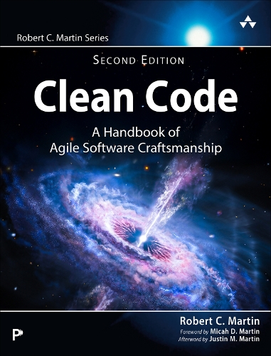

# Library Management System

This is a Library Management System built with ASP.NET Core MVC, Entity Framework Core, and ASP.NET Core Identity. It provides book, borrowing, reservation, fine, feedback, profile, and report management for librarians and members.

**GitHub Repository:** [fahim-ahmed-sarker/LibraryManagementSystem](https://github.com/fahim-ahmed-sarker/LibraryManagementSystem)

## Website Preview

The repository includes the following logo and book cover images as a visual preview of the project:


| Book catalogue preview | Book catalogue preview | Book catalogue preview | Book catalogue preview |
|---|---|---|---|
|  |  |  |  |

The main screens and workflows available in the application are:

- Home page: library introduction, featured books, and new arrivals
- Book Catalogue: search, genre filter, availability status, details, and editing
- Book Details: cover image, author, ISBN, summary, ratings, and reviews
- Reports Dashboard: total books, members, borrowings, overdue books, and fines
- Account: member/librarian registration, login, profile settings, and password change

### Home Page


### Book Catalogue


### Book Details


### Reports Dashboard


> Open the repository link above to view the images on GitHub. After running the local application, open `https://localhost:7070` in a browser to use the complete interactive website.

## Technology Stack

- .NET 8 / ASP.NET Core MVC
- Entity Framework Core 8
- Microsoft SQL Server / LocalDB
- ASP.NET Core Identity
- xUnit and EF Core InMemory for unit testing

## Required Tools

### For Everyone

1. **Git**: To clone the repository from GitHub
2. **.NET 8 SDK**: To build and run the project
3. **SQL Server LocalDB** or **SQL Server Express/Developer**: For the application database
4. **A browser**: Chrome, Edge, or Firefox

### For Visual Studio Code

- Visual Studio Code
- **C# Dev Kit** extension
- **C#** extension, if it is not installed automatically with C# Dev Kit
- **SQL Server (mssql)** extension, if you want to inspect the database

### For Visual Studio

- Visual Studio 2022 (version 17.8 or later recommended)
- The **ASP.NET and web development** workload from Visual Studio Installer
- SQL Server LocalDB is usually installed with Visual Studio. If it is not available, install SQL Server Express or Developer edition.

> Node.js, npm, or a separate frontend build tool is not required. The frontend uses ASP.NET Core Razor Views and static files.

## Clone the Project from GitHub

Open PowerShell or Command Prompt and run:

```powershell
git clone https://github.com/fahim-ahmed-sarker/LibraryManagementSystem.git
cd LibraryManagementSystem
```

After cloning, the solution structure should look like this:

```text
LibraryManagementSystem/
  LibraryManagementSystem.slnx
  LibraryManagementSystem/
  LibraryManagementSystem.Tests/
```

## Restore Dependencies and Build

From the solution folder, run:

```powershell
dotnet restore
dotnet build
```

The main NuGet dependencies are:

- `Microsoft.AspNetCore.Identity.EntityFrameworkCore` 8.0.0
- `Microsoft.AspNetCore.Identity.UI` 8.0.0
- `Microsoft.EntityFrameworkCore.Design` 8.0.0
- `Microsoft.EntityFrameworkCore.SqlServer` 8.0.0
- `Microsoft.EntityFrameworkCore.Tools` 8.0.0

The test project dependencies are:

- `Microsoft.NET.Test.Sdk`
- `xunit`
- `xunit.runner.visualstudio`
- `coverlet.collector`
- `Microsoft.EntityFrameworkCore.InMemory`

## Database Configuration

### Option 1: SQL Server LocalDB (Default)

The default application connection string is in [appsettings.json](LibraryManagementSystem/appsettings.json):

```json
"DefaultConnection": "Server=(localdb)\\MSSQLLocalDB;Database=LibraryManagementSystemDb;Trusted_Connection=True;TrustServerCertificate=True;MultipleActiveResultSets=true"
```

Verify that LocalDB is installed by running this in PowerShell:

```powershell
sqllocaldb info
```

If `MSSQLLocalDB` is not running, start it with:

```powershell
sqllocaldb start MSSQLLocalDB
```

When the application starts, the `LibraryManagementSystemDb` database will be created and the existing EF Core migrations will be applied automatically.

### Option 2: SQL Server Express or Developer

When using SQL Server, use User Secrets instead of putting passwords or production secrets directly in [appsettings.Development.json](LibraryManagementSystem/appsettings.Development.json). Set the development connection string with:

```powershell
dotnet user-secrets init --project .\LibraryManagementSystem\LibraryManagementSystem.csproj
dotnet user-secrets set "ConnectionStrings:DefaultConnection" "Server=.\\SQLEXPRESS;Database=LibraryManagementSystemDb;Trusted_Connection=True;TrustServerCertificate=True;MultipleActiveResultSets=true" --project .\LibraryManagementSystem\LibraryManagementSystem.csproj
```

Change the `Server=` value if your SQL Server instance is different. Example:

```text
Server=localhost;Database=LibraryManagementSystemDb;Trusted_Connection=True;TrustServerCertificate=True;MultipleActiveResultSets=true
```

If you use a SQL username and password, add `User Id` and `Password` to the connection string, but never commit them to source control.

### Migration Information

`Database.MigrateAsync()` runs during application startup, so a separate migration command is normally not required. If necessary, run this manually from the solution folder:

```powershell
dotnet ef database update --project .\LibraryManagementSystem\LibraryManagementSystem.csproj
```

If the `dotnet ef` command is not available:

```powershell
dotnet tool install --global dotnet-ef --version 8.*
```

## Run the Application: Visual Studio Code

1. Open the cloned root folder `LibraryManagementSystem` in VS Code.
2. Install the C# Dev Kit extension.
3. Make sure LocalDB or SQL Server is running.
4. Open the VS Code integrated terminal and run:

```powershell
dotnet restore
dotnet build
dotnet run --project .\LibraryManagementSystem\LibraryManagementSystem.csproj
```

5. Open this URL in a browser:

```text
https://localhost:7070
```

If you see a certificate warning, trust the development certificate:

```powershell
dotnet dev-certs https --clean
dotnet dev-certs https --trust
```

To run without HTTPS:

```powershell
dotnet run --project .\LibraryManagementSystem\LibraryManagementSystem.csproj --launch-profile http
```

Then open `http://localhost:5289`. To use `Run and Debug` in VS Code, select the `https` or `http` project launch profile provided by C# Dev Kit.

## Run the Application: Visual Studio

1. Open Visual Studio 2022.
2. Select `File > Open > Project/Solution`.
3. Open `LibraryManagementSystem.slnx`.
4. Set the web project `LibraryManagementSystem` as the Startup Project.
5. Make sure LocalDB or SQL Server is running.
6. Select `Build > Restore NuGet Packages`, then `Build > Build Solution`.
7. Select the `https` profile in the toolbar and press `F5`.

Visual Studio will usually open `https://localhost:7070` in a browser. To use the HTTP profile, select `http`; the URL will be `http://localhost:5289`.

## Test Run

Run all tests with:

```powershell
dotnet test
```

The test project does not require a real SQL Server; the borrowing service tests use an EF Core InMemory database.

## Initial Usage

- Open `/Account/RegisterMember` to create a member account.
- Open `/Account/RegisterLibrarian` to create a librarian account.
- Use the configured code for the first librarian registration: `LIBRARY2026`.
- Change the librarian registration code for production and store it in User Secrets or an environment variable.

## Useful URLs

| Feature | URL |
|---|---|
| Home | `/` |
| Login | `/Account/Login` |
| Member registration | `/Account/RegisterMember` |
| Librarian registration | `/Account/RegisterLibrarian` |
| Profile settings | `/Account/ProfileSettings` |
| Change password | `/Account/ChangePassword` |
| Librarian reports | `/Reports` |

## Troubleshooting

### `Cannot connect to server` or database error

- Check whether LocalDB is running: `sqllocaldb info MSSQLLocalDB`
- Check whether the SQL Server service is running.
- Change the connection string's `Server=` value to match your instance.
- If the local database is corrupted, you can drop it and restart the application; this will delete local data.

### The `dotnet` command is not recognized

Install the .NET 8 SDK and open a new terminal:

```powershell
dotnet --version
```

You should see a version beginning with `8.x.x`. The SDK is required for building; the runtime alone is not enough.

### HTTPS certificate error

```powershell
dotnet dev-certs https --clean
dotnet dev-certs https --trust
```

Then run the application again.

### Port is already in use

If another application is using the port, change `5289` and `7070` in `Properties/launchSettings.json`, or run with a specific port:

```powershell
dotnet run --project .\LibraryManagementSystem\LibraryManagementSystem.csproj --urls "http://localhost:5099"
```

## Important Security Notes

- Do not use the default librarian code or development connection string from `appsettings.json` in production.
- Never commit production secrets, SQL passwords, or API keys to GitHub.
- Use environment variables, User Secrets, or a secure secret manager for the production database.
- Keep database backups, especially before migrations or schema changes.