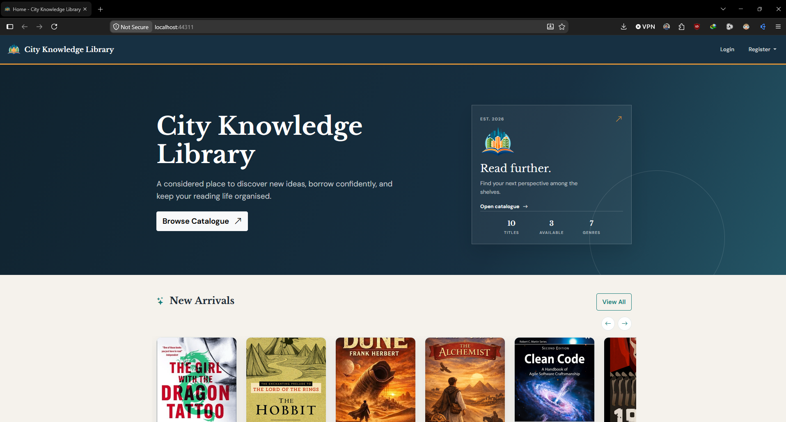
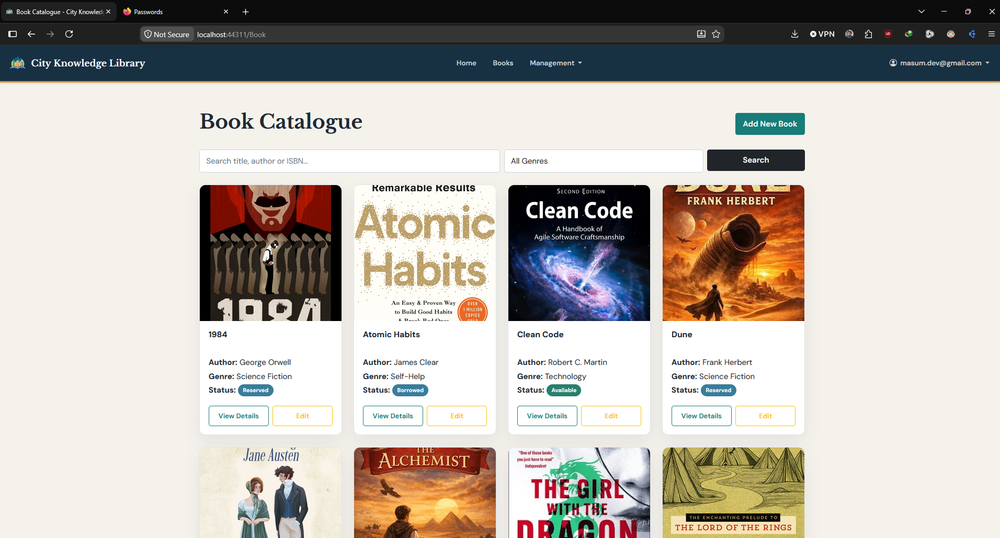
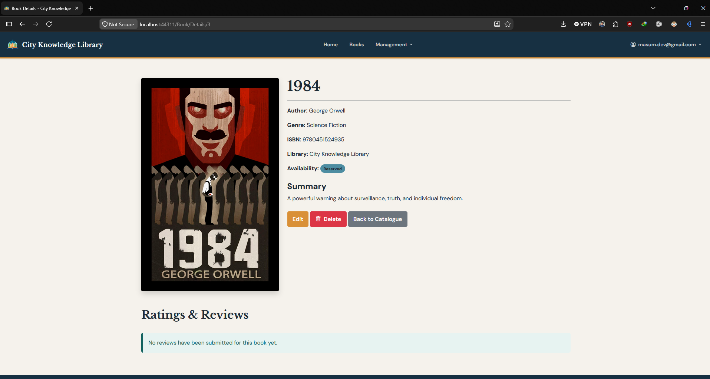
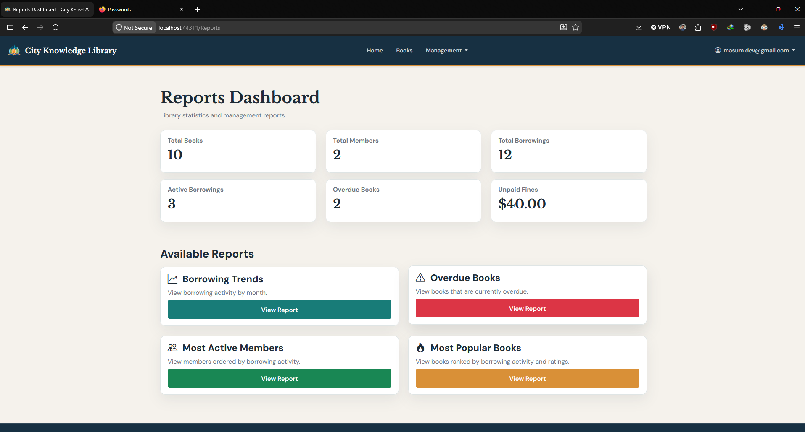

# Library Management System

An ASP.NET Core MVC library management system with member and librarian workflows for books, borrowing, reservations, fines, feedback, profiles, and reports.

**Repository:** [fahim-ahmed-sarker/LibraryManagementSystem](https://github.com/fahim-ahmed-sarker/LibraryManagementSystem)

## Group Details

| Student ID | Full Name | Responsibility |
| --- | --- | --- |
| **20029294** | **Fahim Ahmed Sarker** | **Librarian Module & Documentation:** Librarian registration and authentication, library profile management, book catalogue CRUD, book search and details, book cover upload, borrowing configuration, transaction management, fine management, feedback moderation, reports, librarian dashboard, system documentation and user manual. |
| **20030827** | **Mohammad Mumtahin** | **Member Module & Unit Testing:** Member registration and authentication, book browsing and searching, book details and availability, borrowing, returning, reservation, loan renewal, borrowing history, fines, feedback and ratings, member dashboard, and unit testing of core borrowing and transaction functionality. |

## Preview


### Home



### Book Catalogue



### Book Details



### Reports Dashboard



## Technology

- .NET 8 / ASP.NET Core MVC
- Entity Framework Core 8
- SQL Server or LocalDB
- ASP.NET Core Identity
- xUnit and EF Core InMemory

## Prerequisites

Install the following before starting:

- Git
- .NET 8 SDK
- SQL Server LocalDB, SQL Server Express, or SQL Server Developer
- Visual Studio Code with C# Dev Kit, or Visual Studio 2022 with the **ASP.NET and web development** workload

## Setup

### 1. Clone the Repository

```powershell
git clone https://github.com/fahim-ahmed-sarker/LibraryManagementSystem.git
```

### 2. Open the Project Folder

```powershell
cd LibraryManagementSystem
```

### 3. Start LocalDB

The project uses LocalDB by default. Check whether it is installed:

```powershell
sqllocaldb info
```

Start the default LocalDB instance if necessary:

```powershell
sqllocaldb start MSSQLLocalDB
```

The default connection string is configured in [appsettings.json](LibraryManagementSystem/appsettings.json):

```text
Server=(localdb)\MSSQLLocalDB;Database=LibraryManagementSystemDb;Trusted_Connection=True;TrustServerCertificate=True;MultipleActiveResultSets=true
```

### 4. Restore Dependencies

```powershell
dotnet restore
```

### 5. Build the Solution

```powershell
dotnet build
```

### 6. Run the Application

```powershell
dotnet run --project .\LibraryManagementSystem\LibraryManagementSystem.csproj
```

Open the application at:

```text
https://localhost:7070
```

The application automatically applies the existing EF Core migrations and creates the database when it starts.

### 7. Run Without HTTPS (Optional)

```powershell
dotnet run --project .\LibraryManagementSystem\LibraryManagementSystem.csproj --launch-profile http
```

Open `http://localhost:5289`.

## Visual Studio

1. Open `LibraryManagementSystem.slnx` in Visual Studio 2022.
2. Set `LibraryManagementSystem` as the Startup Project.
3. Confirm that LocalDB or SQL Server is running.
4. Select the `https` profile.
5. Press `F5`.

## Visual Studio Code

1. Open the repository root in VS Code.
2. Install the C# Dev Kit extension.
3. Open the integrated terminal.
4. Run the commands from the [Setup](#setup) section.
5. Select the `https` launch profile from **Run and Debug**, or use the terminal command shown above.

## Database Configuration

To use SQL Server Express or another SQL Server instance, store the connection string with User Secrets instead of committing credentials:

```powershell
dotnet user-secrets init --project .\LibraryManagementSystem\LibraryManagementSystem.csproj
dotnet user-secrets set "ConnectionStrings:DefaultConnection" "Server=.\\SQLEXPRESS;Database=LibraryManagementSystemDb;Trusted_Connection=True;TrustServerCertificate=True;MultipleActiveResultSets=true" --project .\LibraryManagementSystem\LibraryManagementSystem.csproj
```

Replace `Server=.\SQLEXPRESS` with your SQL Server instance when required.

If manual migration is required:

```powershell
dotnet tool install --global dotnet-ef --version 8.*
dotnet ef database update --project .\LibraryManagementSystem\LibraryManagementSystem.csproj
```

## Tests

Run all tests from the solution folder:

```powershell
dotnet test
```

The tests use EF Core InMemory and do not require a separate test database.

## First Login

- Member registration: `/Account/RegisterMember`
- Librarian registration: `/Account/RegisterLibrarian`
- Initial librarian registration code: `LIBRARY2026`

Change the librarian code before using the application in production.

## Troubleshooting

### LocalDB or SQL Server connection error

Confirm that the database service is running and that the `Server=` value in the connection string matches your SQL Server instance.

### HTTPS certificate error

```powershell
dotnet dev-certs https --clean
dotnet dev-certs https --trust
```

### Port already in use

Run the application on another port:

```powershell
dotnet run --project .\LibraryManagementSystem\LibraryManagementSystem.csproj --urls "http://localhost:5099"
```

## Security

- Do not commit SQL passwords, API keys, or production secrets.
- Do not use the default librarian code in production.
- Use User Secrets, environment variables, or a secure secret manager for production configuration.
